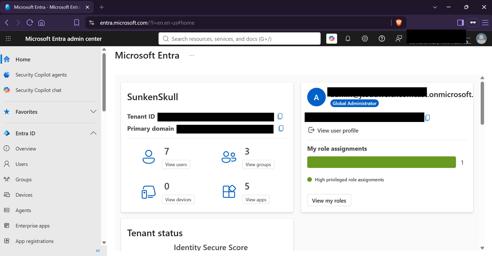
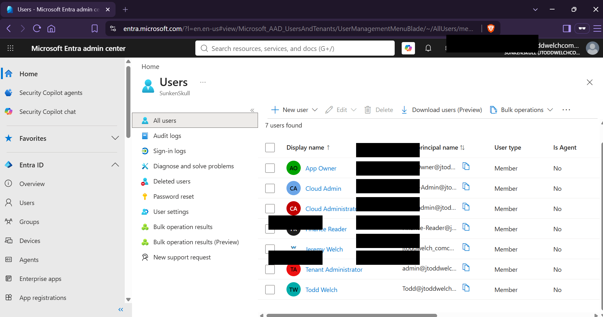
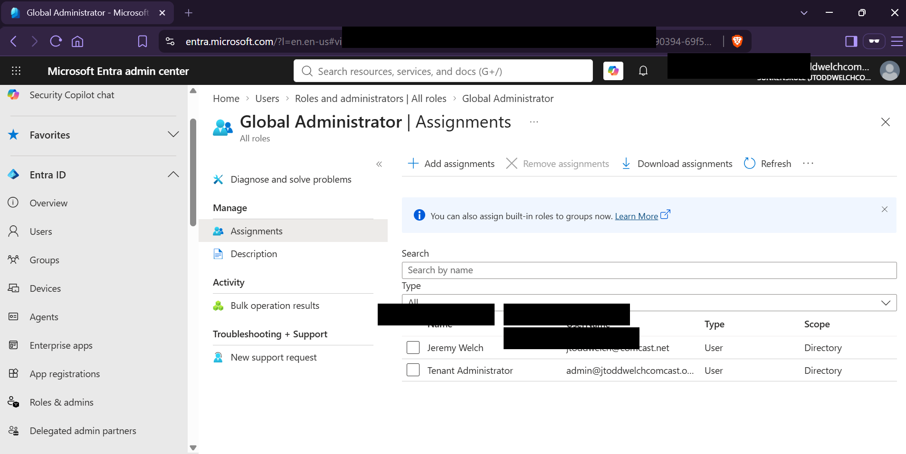
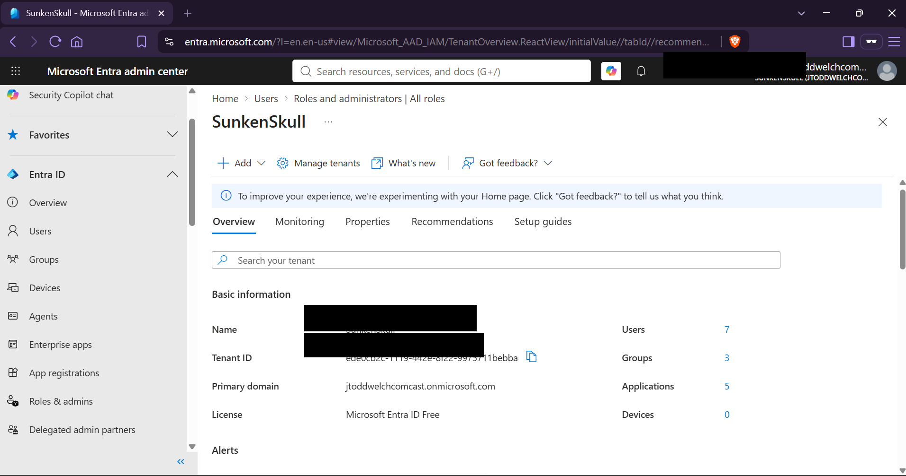
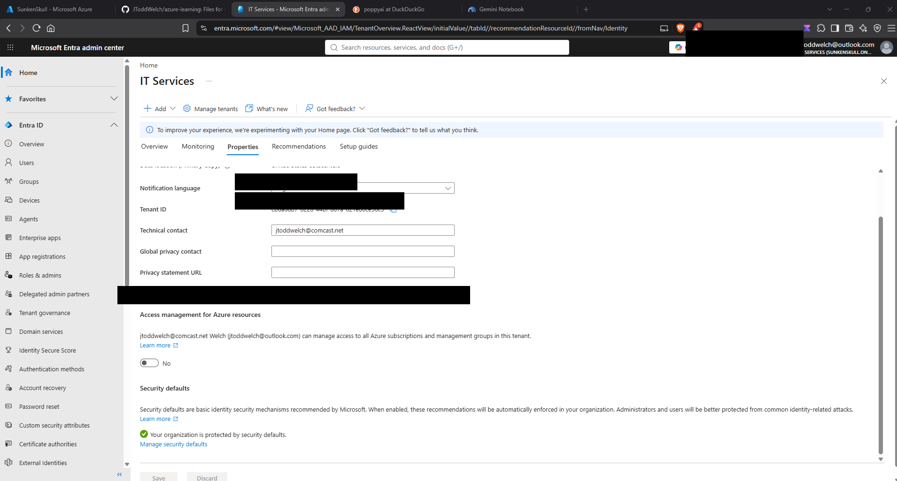

## Screenshots

### Entra Tenant Overview

The lab uses a dedicated Microsoft Entra tenant for identity and access management.

### Lab Identities

Separate identities are used for administration, application ownership, and least-privilege testing.

### Global Administrator Assignment

A dedicated cloud-native Tenant Administrator account is assigned the Global Administrator directory role.

### Native Administrative Session

The dedicated administrative identity is used for Microsoft Entra tenant administration rather than relying exclusively on a personal Microsoft account.

### Security Defaults

Microsoft Entra Security Defaults provide the baseline identity-security configuration for the lab tenant.

> MFA registration for the dedicated administrative account is a planned security-hardening task and will be documented separately when completed.# Identity and Governance
